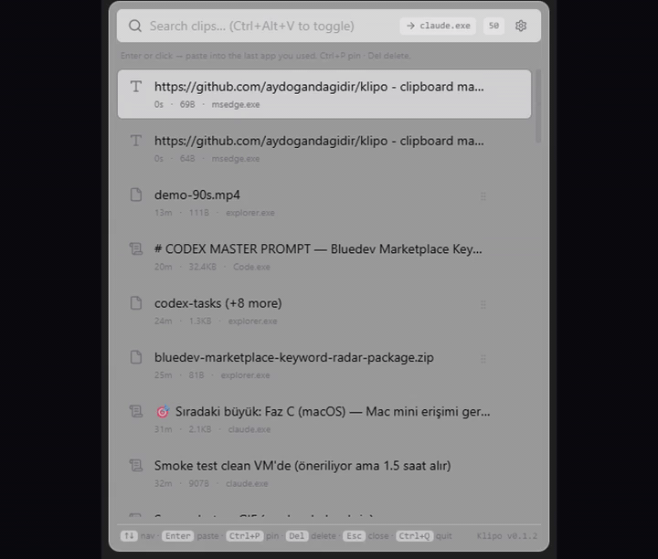
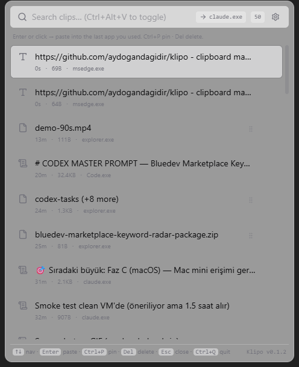
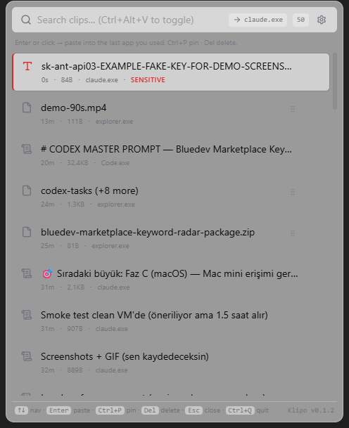
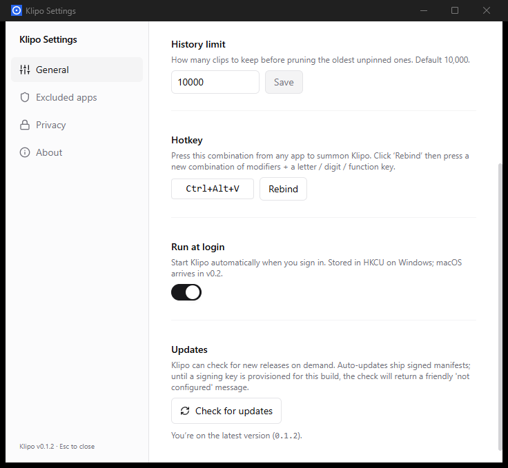

# Klipo

> Cross-platform clipboard manager with end-to-end encrypted sync.
> Fast, private, keyboard-first — on Windows today, macOS in v0.2.

**Status:** v0.1 shipped. Daily-driver Windows MVP with auto-update wired. Faz C (macOS port) is next.

<p align="center">
  
</p>

## Download

Grab the latest signed installer for Windows 10/11 from the [Releases page](https://github.com/aydogandagidir/klipo/releases/latest):

- **`Klipo_<version>_x64-setup.exe`** — NSIS installer (recommended, ~3.8 MB). Faster install, smaller download, smoother auto-update path.
- **`Klipo_<version>_x64_en-US.msi`** — Windows Installer (~5.3 MB). Use this for Group Policy / SCCM / Intune deployment.

> **Note on SmartScreen:** historical builds (v0.1.0 – v0.1.2) were signed only for auto-update integrity (Ed25519) and triggered a "Unknown publisher" SmartScreen warning. Klipo v0.1.3 onward is **Authenticode-signed** (see [release notes](https://github.com/aydogandagidir/klipo/releases)) so SmartScreen accepts it normally. If your installer is unsigned, you are on a historical build — please upgrade.

After installing, press **`Ctrl+Alt+V`** anywhere to open Klipo. The 4-step onboarding tour walks through summon, paste, pin/delete, and how to quit.

## Why Klipo

The clipboard manager space has a gap that Klipo fills: **cross-platform + modern UI + AI-native + offline-first + opt-in E2E sync.** Most existing options are platform-locked, paid, or developer-flavored. Klipo aims to feel native on every desktop, keep your data on your machine by default, and earn its place in your daily flow.

What ships in v0.1 (Windows):

- Capture: text · image · file · RTF · HTML, with hash-based dedup
- Search: SQLite FTS5 with Türkçe character folding
- Privacy: 13-pattern sensitive content guard (API keys, credit cards, JWTs); per-app exclusion list with seed for common password managers
- Native OS drag-and-drop from the popup into browser-shell apps (Chromium silently rejects `Ctrl+V` of file payloads — drag is the only working path)
- Hotkey rebind, theme picker, autostart, wipe-all, full Settings UI
- Auto-update via signed manifest + Tauri-plugin-updater (verified working in production: v0.1.0 → v0.1.1 → v0.1.2 chain)

## What it looks like

| Captured clipboard | Sensitive content guarded | Polished settings |
| :---: | :---: | :---: |
|  |  |  |
| `Ctrl+Alt+V` from any app summons the popup. Search filters across kinds; ↑↓ navigates; Enter pastes back. | API keys, credit cards, JWTs and 10+ other patterns get a red left border, blurred preview, and a paste-confirm dialog. | Theme, hotkey rebind, history limit, autostart, signed auto-updates — all in one decorated window. |

---

## How Klipo Works (Daily Use)

Klipo is a **headless** app — no visible window unless you summon it.

1. **It listens in the background.** Every `Ctrl+C` you do anywhere
   (browser, IDE, terminal, chat app) is captured into a local SQLite
   database. Sensitive content (API keys, credit cards, JWTs) is flagged
   with a red border and blurred preview.
2. **Summon the popup with `Ctrl+Alt+V`.** It appears on top of the app
   you were just using. That app stays "the previously focused app"
   while you interact with Klipo.
3. **Search or scroll.** Type to filter (FTS5 BM25-ranked); use `↑/↓`
   to navigate the list.
4. **Hit Enter (or click) on a clip.** Klipo hides itself, waits ~80 ms
   for Windows to refocus your previous app, writes the clip to the
   system clipboard, then synthesizes `Ctrl+V` so the previous app
   receives a normal paste.
5. **Esc** closes the popup without pasting.

### How to quit Klipo

Klipo keeps running after you close the popup — that's the whole point of a clipboard manager. To shut it down completely:

- **Easy:** while the popup is open, press `Ctrl+Q`.
- **Anywhere:** find the Klipo icon in the Windows tray (the chevron `▲` next to the system clock; on Win 11 you may need to expand the overflow first), **right-click** → **Quit**.
- **From Settings:** open Settings (gear icon in the popup, or tray right-click → Settings…) → About tab → **Quit Klipo** button.

### How to bring Klipo back after quitting

Quitting kills the process — your hotkey stops responding because nothing is listening for it anymore. To start Klipo again:

- **Easiest:** Press `Win`, type **Klipo**, hit Enter.
- **Or:** Run `%LOCALAPPDATA%\Klipo\Klipo.exe` (the path the NSIS installer dropped Klipo into).
- **Or:** Use `Win + R`, type **klipo**, hit Enter.

Within a couple of seconds the tray icon reappears and the hotkey works again.

If you'd rather not think about this every reboot, enable **Run at login** in Settings → General — Klipo then starts automatically when you sign in to Windows.

### "It looked like it duplicated the clip"

It didn't. When Klipo pastes, the OS sees its own clipboard write as a
new clipboard event, so the watcher captures it again. But because the
SHA-256 hash matches an existing clip, the storage layer **bumps the
existing row** to the top of the list instead of inserting a duplicate.
Total clip count stays the same; only the order changes.

### Excluded apps (default)

Captures while a known password manager is foreground are dropped silently. The default seed list ships in [`001_initial.sql`](./src-tauri/src/storage/migrations/001_initial.sql) and matches common password manager process names / bundle ids. You can edit the list in M6 (settings UI).

### Test it the right way

The popup is most confusing when you summon it from inside the same app
you're reading from. To see clearly what's happening:

1. Open Notepad. Click into the editor area.
2. Now press `Ctrl+Alt+V`. Klipo's popup overlays Notepad.
3. Press `Enter` (or click) on any clip. The popup hides; Notepad
   receives a paste of that clip's text.

If you summon the popup from inside the same app you're reading from and click a
clip, **the paste lands back in that same app** — that's correct
behaviour, just sometimes surprising.

---

## Quick Start (developer)

Prerequisites:

- **Node.js 20+** and **pnpm 9+** (`corepack enable && corepack prepare pnpm@latest --activate`)
- **Rust 1.83+** stable toolchain (`rustup default stable`)
- **Windows 10 1809+** (v0.1 builds target Windows; macOS arrives in v0.2)
- WebView2 runtime (preinstalled on Windows 11; Win10 needs the Evergreen installer)

First-run setup:

```bash
pnpm install            # frontend deps + tauri CLI
pnpm tauri dev          # opens a 480×600 window saying "Klipo" + IPC ping result
```

If `pnpm tauri dev` warns about missing icons, see [`src-tauri/icons/README.md`](./src-tauri/icons/README.md).

Other useful scripts:

```bash
pnpm lint               # ESLint (no warnings allowed)
pnpm typecheck          # TypeScript --noEmit, strict
pnpm test               # Vitest

cd src-tauri
cargo fmt --all -- --check
cargo clippy --all-targets --all-features -- -D warnings
cargo test
```

Phase A bench (optional, validates SQLite + FTS5 perf budgets):

```bash
cd bench
cargo bench --bench sqlite_fts
cargo bench --bench turkish_search
```

---

## Principles

1. **Offline-first.** Every local feature works without internet. Sync is opt-in.
2. **Privacy by default.** Clipboard data is among the most sensitive a user has. End-to-end encryption is mandatory; neither us nor the server sees content.
3. **Fast or not at all.** Open <100ms, search <50ms (up to 10K items). Slow = uninstall.
4. **Keyboard-first.** Mouse is optional; every action has a shortcut.
5. **AI helps when it's better.** Never auto-pastes AI output without user approval.

## Roadmap (Summary)

- **v0.1 — MVP (Windows-first):** local clipboard history, FTS5 search, pinned items, sensitive-content auto-detect, dark mode, auto-update.
- **v0.2 — macOS port + snippets + OCR + command palette.**
- **v0.3 — E2E sync, AI transforms, multi-device pairing.**
- **v1.x — Linux, browser extension, plugins.**

See [docs/](./docs/) for detailed architecture, security model, and protocol specs.

## License

Klipo (v0.1.3 and later) is a **commercial product** distributed under a proprietary End User License Agreement.

- License terms: [LICENSE](./LICENSE) · [LEGAL/EULA.md](./LEGAL/EULA.md)
- Privacy: [LEGAL/PRIVACY.md](./LEGAL/PRIVACY.md)
- Refund policy: [LEGAL/REFUND.md](./LEGAL/REFUND.md)
- Buy a license: [Klipo on Gumroad](https://gumroad.com/l/klipo) _(coming soon)_

Earlier versions (**v0.1.0 – v0.1.2**) remain available under **Apache-2.0** — see [LICENSE-Apache-2.0-historical.md](./LICENSE-Apache-2.0-historical.md). Third-party components retain their original open-source licenses; see [NOTICE](./NOTICE).

## Status & Contributing

Pre-1.0. The Windows daily-driver path works end-to-end: capture, search, paste (text / image / file / RTF / HTML), pin, delete, sensitive-content guard, native drag-and-drop, full Settings UI (theme, hotkey rebind, excluded apps, telemetry, wipe-all), and a 3-step welcome tour.

Read [`CONTRIBUTING.md`](./CONTRIBUTING.md) before opening a PR. Architecture and budgets you must respect: [`docs/perf-budget.md`](./docs/perf-budget.md), [`docs/security.md`](./docs/security.md). Vulnerability disclosure: [`SECURITY.md`](./SECURITY.md).

Architecture feedback before code lands → open a discussion.

---

Klipo is built and maintained by [**bluedev**](https://bluedev.dev) — software & AI business automation. Support: support@bluedev.dev.
